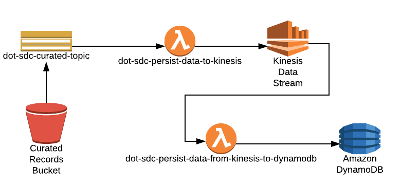

# sdc-dot-waze-kinesis-data-persist-to-dynamo
This lambda function is developed by SDC Team for persisting the curated data from Kinesis Data Stream in DynamoDB.

There are two primary functions that this lambda function serves:
* **get_latest_batch** - gets the latest batch Id stored in the AWS Systems Manager Parameter Store against which the waze record has to be persisted in DynamoDB.
* **persist_to_dynamoDB** - stores the curated data in DynamoDB.

<a name="toc"/>

## Table of Contents

[I. Release Notes](#release-notes)

[II. Overview](#overview)

[III. Design Diagram](#design-diagram)

[IV. Getting Started](#getting-started)

[V. Unit Tests](#unit-tests)

[VI. Support](#support)

---

<a name="release-notes"/>


## [I. Release Notes](ReleaseNotes.md)
TO BE UPDATED

<a name="overview"/>

## II. Overview
The primary function of this lambda function is:

**1.** Poll the data from Kinesis Stream

**2.** Decode the event from the Kinesis Stream

**3.** Get the latest batch Id from AWS Systems manager parameter store

**4.** Store the record corresponding to the latest Batch Id in DynamoDB.

**5.** In case of any failures/errors it pushes the messages in DLQ so that these messages can be analysed/processed later.

<a name="design-diagram"/>

## III. Design Diagram



<a name="getting-started"/>

## IV. Getting Started

The following instructions describe the procedure to build and deploy the lambda.

### Prerequisites
* NA 

---
### ThirdParty library

*NA

### Licensed softwares

*NA

### Programming tool versions

*Python 3.6


---
### Build and Deploy the Lambda

#### Environment Variables
Below are the environment variable needed :- 

DDB_CURATED_RECORDS_TABLE_ARN - {name_of_dynamodb_table_to_store_the_curated_records}

LATEST_BATCH_ID  - {key_name_in_SSM_for_latest_batch_id}

PERSIST_RECORDS  - {no_of_records_to_be_persisted}

#### Build Process

**Step 1**: Setup virtual environment on your system by following below link
https://docs.aws.amazon.com/lambda/latest/dg/with-s3-example-deployment-pkg.html#with-s3-example-deployment-pkg-python

**Step 2**: Create a script with below contents e.g(sdc-dot-waze-kinesis-data-persist-to-dynamo.sh)
```#!/bin/sh

cd sdc-dot-waze-kinesis-data-persist-to-dynamo
zipFileName="sdc-dot-waze-kinesis-data-persist-to-dynamo.zip"

zip -r9 $zipFileName common/*
zip -r9 $zipFileName README.md
zip -r9 $zipFileName waze_persist_to_dynamo_handler_main.py
```

**Step 3**: Change the permission of the script file

```
chmod u+x sdc-dot-waze-kinesis-data-persist-to-dynamo.sh
```

**Step 4** Run the script file
./sdc-dot-waze-kinesis-data-persist-to-dynamo.sh

**Step 5**: Upload the sdc-dot-waze-kinesis-data-persist-to-dynamo.zip generated from Step 4 to a lambda function via aws console.

[Back to top](#toc)

---
<a name="unit-tests"/>

## V. Unit Tests

TO BE UPDATED

---
<a name="support"/>

## VI. Support

For any queries you can reach to support@securedatacommons.com
---
[Back to top](#toc)